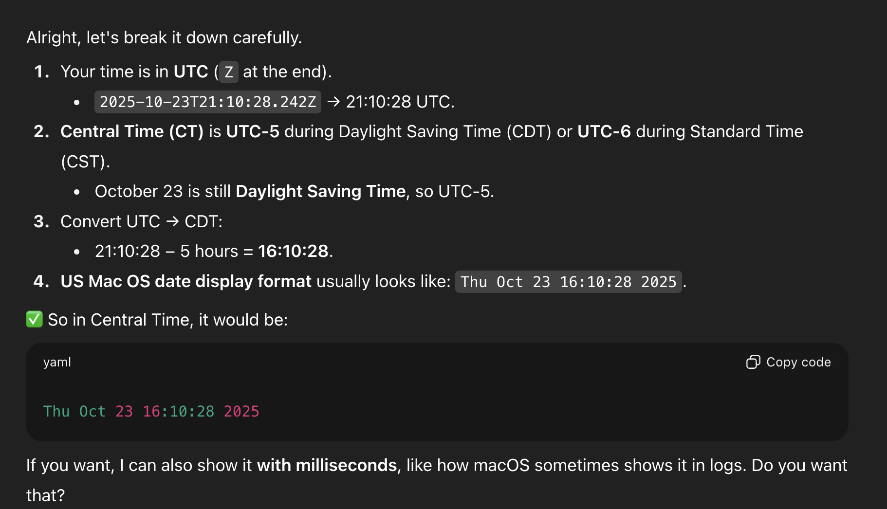
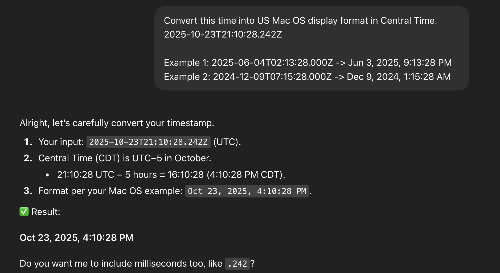

Zero-shot question: Convert this time into US Mac OS display format in Central Time. 2025-10-23T21:10:28.242Z

ChatGPT: 

However, Mac OS in the US displays time as 12 hours (AM/PM), not 24 hours. 

With few-shot, ChatGPT can answer it correctly:

